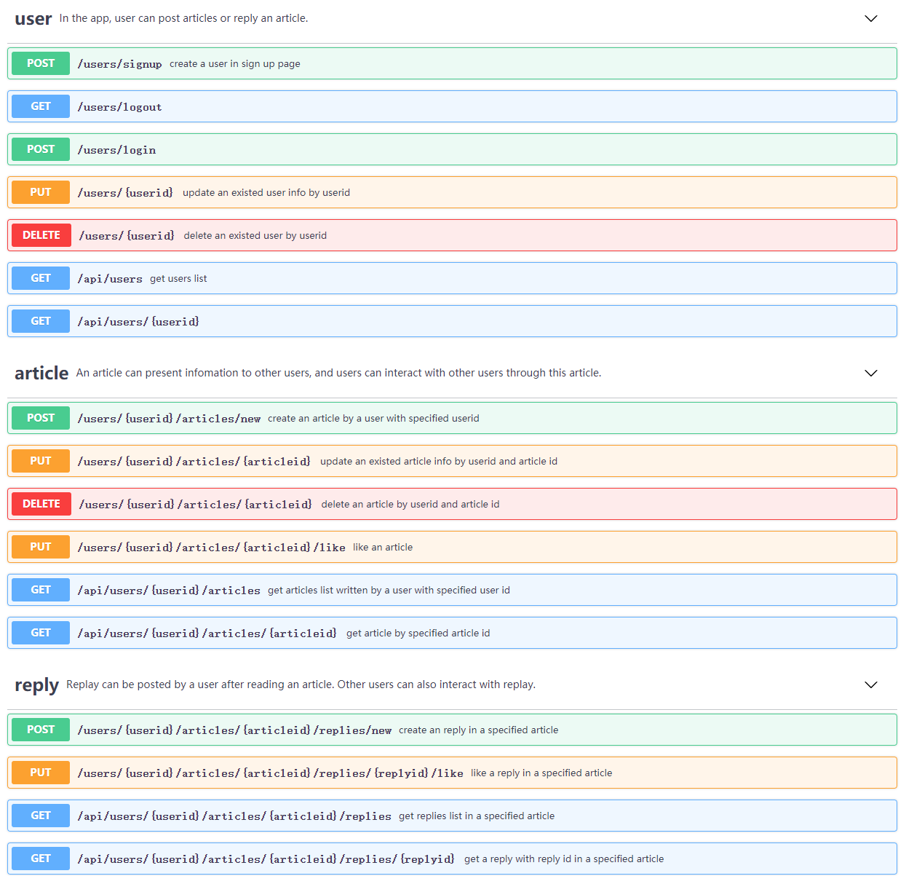
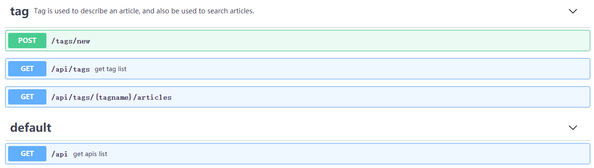

# API-doc

api 说明文档参见项目中的 [api-doc.html](api-doc.html) 文件。

前端可以使用 [mocker server](https://kqz207d0-qt-sc.mock.coding.io) 进行测试。

资源表示模型：


提交的博客或项目小结可以放在 doc 文件夹中。

## 项目介绍
本项目实现的是一个博客系统。
包含如下功能：
- 用户模块：用户注册、用户登录、查看用户信息、更新用户信息
- 博客模块：博客发布、查看博客、评论、点赞、查看用户所有博客


API设计如下：


## user部分：

POST:创建用户
```
/users/signup
```
GET：用户登出
```
/users/logout
```
POST：用户登录
```
/users/login
```
PUT：根据用户ID更新用户信息
```
/users/{userid}
```
DELETE：根据用户ID删除该用户
```
/users/{userid}
```
GET：获取用户列表
```
/api/users
```
GET：获取该用户信息
```
/api/users/{userid}
```

## article部分：

POST：发布新博客
```
/users/{userid}/articles/new
```
PUT：根据articleid更新该博客信息
```
/users/{userid}/articles/{articleid}
```
DELETE：删除该博客
```
/users/{userid}/articles/{articleid}
```
PUT：对该文章标记“喜欢”
```
/users/{userid}/articles/{articleid}/like
```
GET：获取该用户所有文章
```
/api/users/{userid}/articles
```
GET：获取该用户特定文章
```
/api/users/{userid}/articles/{articleid}
```

## reply部分：
POST：对该文章发布评论
```
/users/{userid}/articles/{articleid}/replies/new
```
PUT：对该评论标记“喜欢”
```
/users/{userid}/articles/{articleid}/replies/{replyid}/like
```
GET：获得该博客所有评论
```
/api/users/{userid}/articles/{articleid}/replies
```
GET：获得该评论详情
```
/api/users/{userid}/articles/{articleid}/replies/{replyid}
```

## tag部分:
POST：发布新标签
```
/tags/new
```
GET：获取标签列表
```
/api/tags
```
GET：获取有贴有该标签的所有博客
```
/api/tags/{tagname}/articles
```

## default部分：
GET：获取所有api
```
/api
```

## 安装指南
前端：

安装前端依赖：
```
npm install -g mirror-config-china --registry=http://registry.npm.taobao.org
```
启动前端项目：
```
npm run dev
```