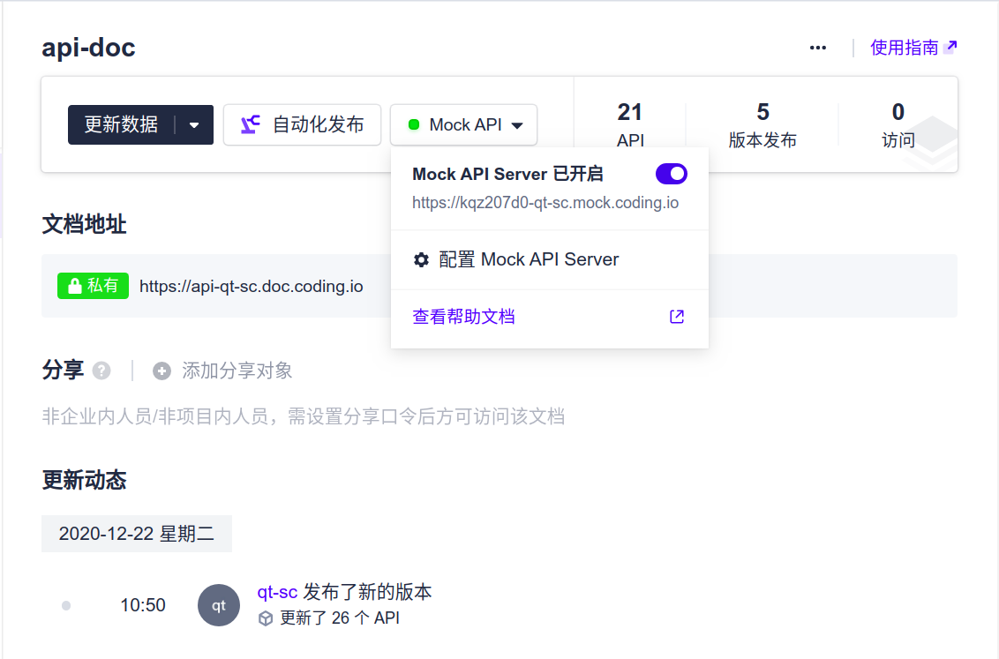
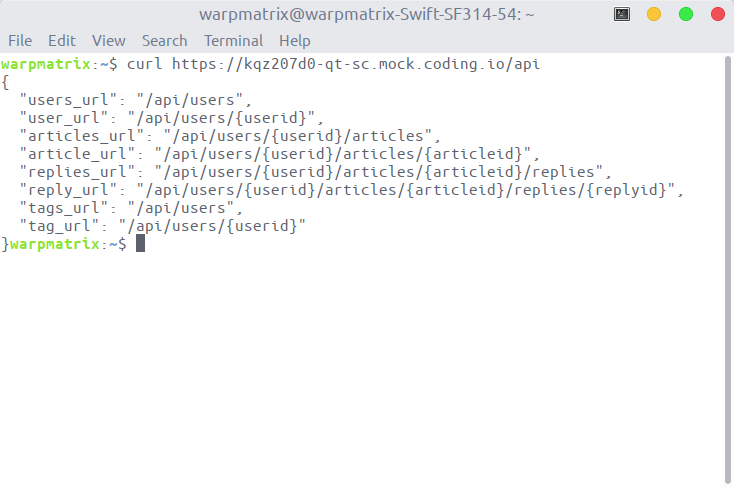

<!-- omit in toc -->
# 项目文档

<!-- omit in toc -->
## Table of Contents

- [1. 团队成员](#1-团队成员)
- [2. 项目介绍](#2-项目介绍)
- [3. 技术支持](#3-技术支持)
- [4. API 设计](#4-api-设计)

## 1. 团队成员

| 姓名   | 学号     | 承担工作                                                                                              |
| ------ | -------- | ----------------------------------------------------------------------------------------------------- |
| 赖培文 | 18342041 | 负责后端 Server 部分，关于数据库接口和服务接口的实现                                                  |
| 李赞辉 | 18342053 | 知乎日报的信息拉取，获取文章、评论、点赞等相关信息，json解码，完成数据库存储                          |
| 吴翠萍 | 16328086 | 完成鉴权模块：用户注册登录，设置cookie、token 加入白名单，检查 token 有效，用户登出清除 cookie、token |
| 梁允楷 | 18342055 | 参与了 api 文档的制订、生成后端和前端代码、构建 mock server 服务、使用 postman 测试 API               |
| 喻勇强 | 18342123 | 负责API设计，整体功能设计，修改前端代码 |
团队中每位成员提交的博客或项目小结放在 doc 文件夹中。

## 2. 项目介绍

本项目针对知乎平台的内容，构建了一个简单的社交互动平台。知乎是一个优良的知识分享平台，但随着知乎平台的扩大和破圈，其内容和社区质量逐渐下降。本项目通过知乎提供的 api 获取知乎数据，并将优良的内容部署在我们构建的社交互动平台。

我们的项目实现了一些基本的功能模块。如用户注册、用户登录、查看用户信息、更新用户信息等对用户功能的支持；博客模块支持博客发布、查看博客、评论，并可以点赞相关博客、评论等。除此以外，我们还对用户信息安全方面进行了充分的管理，开发设置了鉴权模块。对无权限用户或用户的越权行为作出了限制，保证系统安全稳定地运行。并且实现了用户根据自己需求使用标签搜索自己所需的文章等其他功能。

本仓库的文件结构如下：

```plaintext
.
├── api-doc.html    // api 文档
├── api.yaml        // OpenApi 文档
├── doc             // 成员的报告博客
├── image           // 报告所使用的图片
├── README.md       // 项目报告
└── src             // 使用 api 自动构建生成的项目代码
```

项目主要使用到的资源共有四种：用户、文章、评论、标签。具体的资源表示模型如下：


## 项目介绍
本项目实现的是一个博客系统。
包含如下功能：
- 用户模块：用户注册、用户登录、查看用户信息、更新用户信息
- 博客模块：博客发布、查看博客、评论、点赞、查看用户所有博客


API设计如下：


## user部分：

POST:创建用户
```
/users/signup
```
GET：用户登出
```
/users/logout
```
POST：用户登录
```
/users/login
```
PUT：根据用户ID更新用户信息
```
/users/{userid}
```
DELETE：根据用户ID删除该用户
```
/users/{userid}
```
GET：获取用户列表
```
/api/users
```
GET：获取该用户信息
```
/api/users/{userid}
```

## article部分：

POST：发布新博客
```
/users/{userid}/articles/new
```
PUT：根据articleid更新该博客信息
```
/users/{userid}/articles/{articleid}
```
DELETE：删除该博客
```
/users/{userid}/articles/{articleid}
```
PUT：对该文章标记“喜欢”
```
/users/{userid}/articles/{articleid}/like
```
GET：获取该用户所有文章
```
/api/users/{userid}/articles
```
GET：获取该用户特定文章
```
/api/users/{userid}/articles/{articleid}
```

## reply部分：
POST：对该文章发布评论
```
/users/{userid}/articles/{articleid}/replies/new
```
PUT：对该评论标记“喜欢”
```
/users/{userid}/articles/{articleid}/replies/{replyid}/like
```
GET：获得该博客所有评论
```
/api/users/{userid}/articles/{articleid}/replies
```
GET：获得该评论详情
```
/api/users/{userid}/articles/{articleid}/replies/{replyid}
```

## tag部分:
POST：发布新标签
```
/tags/new
```
GET：获取标签列表
```
/api/tags
```
GET：获取有贴有该标签的所有博客
```
/api/tags/{tagname}/articles
```

## default部分：
GET：获取所有api
```
/api
```

## 安装指南
前端：

安装前端依赖：
```
npm install -g mirror-config-china --registry=http://registry.npm.taobao.org
```
启动前端项目：
```
npm run dev
```
=======
## 3. 技术支持

本项目前端使用 vue.js 构建服务，实现前后端服务器的分离。后端使用 mysql 进行数据持久化，并且使用 gorm 构建后端的服务。使用知乎 api (http://news-at.zhihu.com/api/4/news/latest) 获得后端数据。使用自己构建的中间件实现鉴权功能完成对部分 api 支持 token 认证的功能。

构建 api 使用了 Swagger 工具集，生成了相应的后端和前端的代码，前端使用了 coding 的 mocker server 进行测试返回数据，并使用 postman 对 api 作进一步的可用性测试。



<!-- TODO: 安装指南 -->

## 4. API 设计

对于 api 的设计，使用 restful api 构建服务，保证了 api 的规范和可用性。并且，直接通过上述的资源表示模型直接对应各个对象的 CRUD 操作。**具体的 api 说明文档**参见项目中的 [api-doc.html](api-doc.html) 文件，里面提供了所有的 api 接口，并对相应的 get api 提供了实例，并且实现了 api root 获得简单 api 服务列表的功能。



从 api 文档可以得到类似的实例：

- 删除用户：delete /users/{userid}
- 修改用户的文章：put /users/{userid}/articles/{articleid}

从以上两例可以看出设计的 api 符合 restful api 的规范。

API 具体设计如下：


