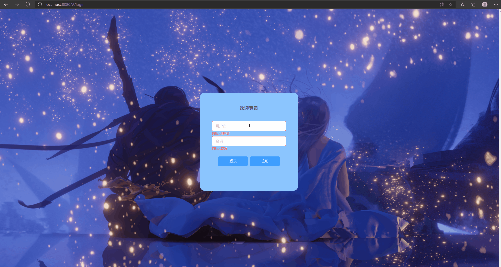
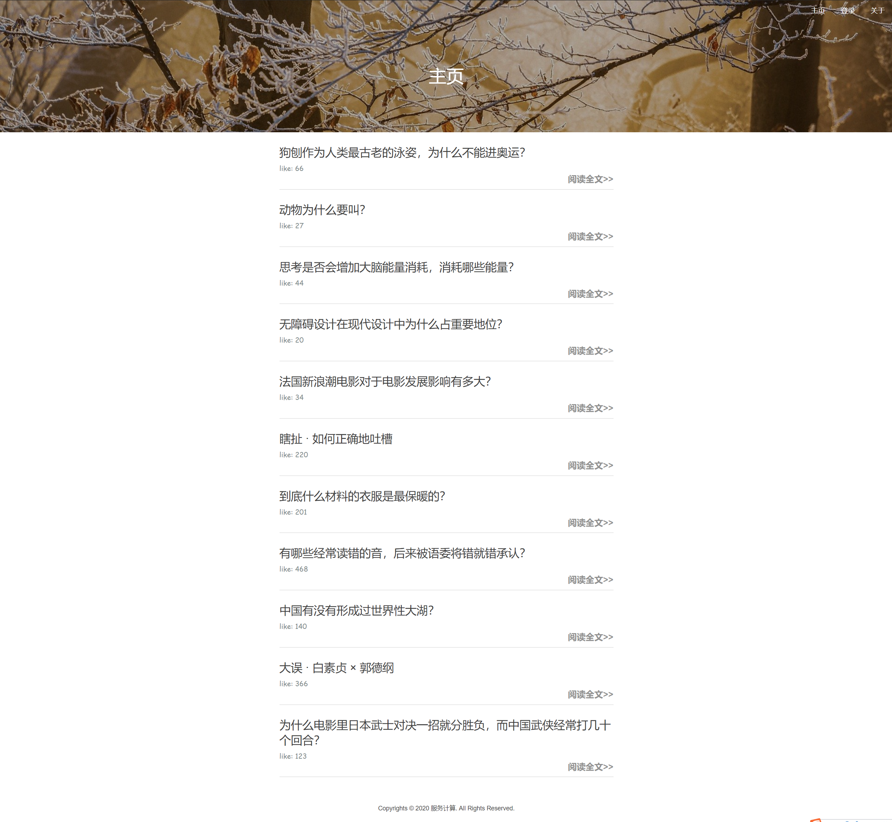
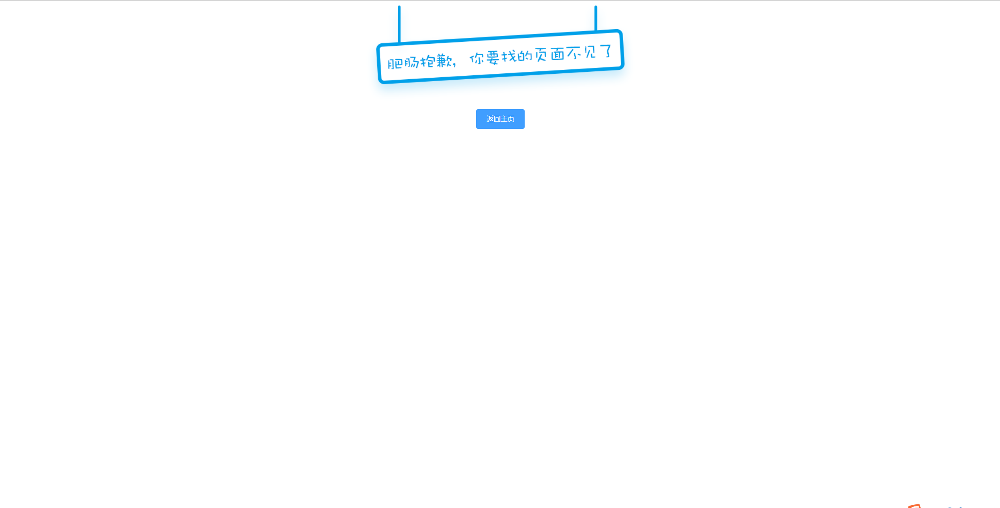

# 前端设计文档

18342017		方浩聪

## 1. 成果展示



[传送门：github 前端项目](https://github.com/qt-sc/front-end)

## 2. 项目结构

```
src
├── api
│   └── index.js
├── App.vue
├── assets
│   ├── css
│   │   └── comment.css
│   ├── img
│   │   ├── background.jpg
│   │   ├── logo.png
│   │   ├── sacrifice.jpg
│   │   └── very_sorry.png
│   └── js
├── components
│   ├── About.vue
│   ├── Article.vue
│   ├── Front.vue
│   ├── Home.vue
│   ├── Login.vue
│   ├── NotFound.vue
│   ├── Reg.vue
│   ├── Tags.vue
│   ├── vfooter.vue
│   └── vheader.vue
├── main.js
├── routes
│   ├── index.js
│   └── routes.js
└── store
    ├── actions.js
    ├── index.js
    ├── MsgAlert.js
    ├── mutations.js
    ├── states.js
    └── types.js
```

## 3. 模块设计

### 3.1 components

该网站一共包括六个页面，分别是：登录页，注册页，主页，详情页，关于页，丢失页。这些页面主要使用了 elementUI 组件进行布局，包括表单，按钮，输入框等。

|    页面    |                             说明                             |                             展示                             |
| :--------: | :----------------------------------------------------------: | :----------------------------------------------------------: |
| 登录注册页 |   提供登录、注册服务的页面，对用户输入的信息进行简单校验。   |  |
|  文章主页  | 给出所有文章的简要信息，包括标题与点赞数，点击文章标题或“阅读全文”按钮即可查看文章详情。 |  |
| 文章详情页 |      提供文章的全部信息，包括文章标题，内容，点赞数等。      |  |
|   关于页   |               展示网站相关信息，提供项目链接。               |  |
|   丢失页   | 当前端无法路由到用户所请求的页面是将出现该页，页面包括提示信息与返回主页的按钮。 |  |

### 3.2  routes

文章的路由信息主要包括五个部分，其路径也页面的对应信息如下：

```js
routes: [
        {
            path:'/',
            component:Front,//这是文章页
            hidden:true,
            children:[
                {path:'',redirect:'home',  meta:{auth:false}},
                {path:'home',component:Home,  meta:{auth:false}},
                {path:'about',component:About,  meta:{auth:false}},
                {path:'article/:id',component:Article, meta:{auth:false,scrollToTop: true}},
            ]
        },
        {
            path:'/reg',
            component:Reg,
            meta:{auth:false},
            hidden:true
        },
        {
            path: '/login',
            name: 'Login',
            component: Login
        },
        {
            path: '/about',
            name: 'About',
            component: About
        },
        {
            path: '*',
            name: 'NotFound',
            component: NotFound
        }
    ]
```

在路由之前，对路径进行判断，若请求路径需要权限才能获取，则前往登录页面，若登录后再请求登录注册页，则跳转到主页，相关设置如下：

```js
router.beforeEach(({meta,path},from,next)=>{
    store.dispatch('showProgress',0)
    // NProgress.start();
    let {auth=true}=meta
    let isLogin = Boolean(store.state.token)

    /*
        访问不需要权限的设置meta:false
        注册也要设置成meta:false
    */
    console.log(auth, isLogin, path)
    if(auth&&!isLogin&&path!=='/login'){
        return next({path:'/login'})
    }
    // 如果登录了以后再访问reg和login则路由到Home
    if(isLogin&&(path=='/login'||path=='/reg')){
        return next({path:'/home'});
    }
    // 未登录的情况下访问reg则直接路由
    next();
})
```

### 3.3 store

网站包括如下几个状态：

```js
export const USER_SIGNIN = 'USER_SIGNIN'
export const USER_SIGNOUT = "USER_SIGNOUT"
export const USER_REG = "USER_REG"
export const SHOW_PROGRESS = "SHOW_PROGRESS"
export const HEAD_LINE = 'HEAD_LINE'
```

当对状态进行commit或dispatch时执行如下操作：

```js
import {USER_SIGNIN,USER_SIGNOUT,USER_REG,SHOW_PROGRESS,HEAD_LINE} from './types'
export default  {
    [USER_REG](state,token){
        localStorage.setItem('jwt',token);
        state.token = token;
    },
    [USER_SIGNIN](state,token){
        localStorage.setItem('jwt',token);
        state.token = token;
    },
    [USER_SIGNOUT](state){
        localStorage.removeItem('jwt');
        state.token = null;
    },
    [SHOW_PROGRESS](state,number){
        state.progress = number
    },
    [HEAD_LINE](state,headline){
        state.headline  = headline
    }
}
```

此外，在每次刷新页面时，判断用户是否登录：

```js
export default {
    token:isLoggedIn()||null,
    progress:0,
    headline:''
    // 每次刷新页面或者再次访问的时候都会重新渲染状态,
    // 这里相当于给每次刷新重新设置初始值
}

function isLoggedIn(){
    let token = localStorage.getItem('jwt');
    if(token){
        const payload = JSON.parse(window.atob(token.split('.')[1]));
        // 前端判断token是否过期，如果过期了访问时候会路由到login页面
        if(payload.exp>Date.now()/1000){
            return token;
        }
    }else{
        return false;
    }
}
```

## 4. 问题&解决

### 4.1 跨域问题

>跨域是指一个域下的文档或脚本试图去请求另一个域下的资源，这里跨域是广义的。我们通常所说的跨域是狭义的，是由浏览器同源策略限制的一类请求场景。
>
>同源策略/SOP（Same origin policy）是一种约定，它是浏览器最核心也最基本的安全功能，如果缺少了同源策略，浏览器很容易受到XSS、CSFR等攻击。所谓同源是指"协议+域名+端口"三者相同，即便两个不同的域名指向同一个ip地址，也非同源。

因为前端与后端是分离的，因此在同源策略的限制下，从前端服务器请求后端资源时需要解决跨域问题。我们在前端对配置文件进行代理设置，将API请求代理到后端服务程序上，可以实现跨域。

```js
devServer: {
    open: true,
    host: 'localhost',
    port: '8080',
    proxy: {
        '/': {//业务类的接口请求地址
            changeOrigin: true, // 必须设置，表示允许跨域
            ws: true,
            target: 'http://localhost:8085',//后端服务程序地址
        }
    }
}
```

## 5. 总结

因为之前从未接触过 Vue 框架，从零开始学习并完成前端的搭建花费了我很大的精力，其中遇到的大部分困难是由缺乏经验导致的，在这之前，我从未了解过跨域是什么，Cookie是如何实现的，前端各部分如何解耦等等。学习这些知识让我受益匪浅。因为前端服务是建立在后端服务的基础上的，而mock后端的不完善与真正后端服务的脆弱性导致前端开发困难重重，我的每一个网络请求都需要参照着后端实现进行尝试，避免造成后端的崩溃，并时刻检查数据库的变化，检查数据是否成功插入，这是一个艰苦的挑战。对于缺乏团队开发经验的我们来说，从github项目管理，到与后端开发同学的协商，一步步解决前后端交互的各个问题，这是宝贵的团队协作经验。