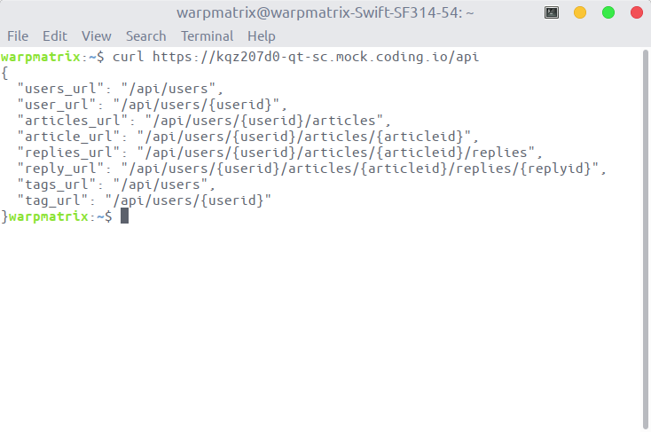

<!-- omit in toc -->
# 项目小结

本次前后端分离开发作业，我主要参与了 api 文档的制订工作。主要使用到的工具集有：

- OpenAPI-GUI：入门设计 Open-Api 完成项目 API 的初步设计
- Swagger Editor：使用 Swagger 对 API 文档进行细致修改，并自动生成后端服务器和前端客户端的代码
- Coding：构建 mock server 服务，为前端开发提供随机数据
- Postman：使用 postman 测试 API 的设计

<!-- omit in toc -->
## Table of Contents

- [1. API 的初步设计](#1-api-的初步设计)
- [2. Swagger 修改 API 文档](#2-swagger-修改-api-文档)
  - [2.1. 路由信息的定义](#21-路由信息的定义)
  - [2.2. OpenAPI 文档复用](#22-openapi-文档复用)
- [3. 构建 mock 服务器](#3-构建-mock-服务器)
- [4. Api 的测试](#4-api-的测试)

## 1. API 的初步设计

使用 OpenAPI-GUI 工具，可以让我们从零快速入门配置我们的 API 文档。使用 GUI 工具，可以让我们快速设置项目描述、服务器配置、路由信息等。这样配置可以让我们将注意力放在具体的 API 设置，无需特地具体地关注 OpenAPI 文档的具体写法。此时，我们也可以将项目的具体业务逻辑思考清楚，可以得到如下的资源表示模型：


完成相应的配置后，我们可以直接导出对应的 json 文件或 yaml 文件。

## 2. Swagger 修改 API 文档

使用 Swagger 可以更细致地编写 API 文档，实现更多的功能。如，我们可以复用已定义 API 内容，提高 API 文档的可重用性和拓展性。  

使用字符直接编写 API 文档，需要我们提前了解 OpenAPI 文档的规范写法。首先，OpenAPI 文档的编写有一套具体的 Schema，每一个层次都有其固定可用的字段。如，根文档下有下列固定可用的字段：`openapi`、`info`、`servers`、`paths`、`components`、`security`、`tags`、`externalDocs`。下面提供一个最简单的 OpenAPI 文档作为例子，可以看到其中有 `openapi`、`info`、`path` 三个字段为必须字段。

```yaml
openapi: 3.0.0
info:
  title: Zhihu-Coffee
  version: 0.0.1
paths: {}
```

其中，我们最主要是用到的字段的作用为：

- openapi：定义 openapi 的版本
- info：定义项目的元数据
- paths：定义服务器的路由信息
- components：定义我们可复用的 schemas
- tags：将路由信息进行分组，方便 API 使用者进行阅读

同理，这些字段的下属信息也有对应的 schemas。如：components 可以定义 schemas 进行复用，也可以定义 responses 复用响应，examples 则可以定义随机数据供 mock server 使用，此处不再赘述。

### 2.1. 路由信息的定义

在具体的 `path` 字段中，可以定义具体的路由信息。如下图所示，可以看到 path 直接以各个路由位置作为其字段：


各个路由信息可以定义具体的描述、参数、调用函数、响应、tag 等信息。


### 2.2. OpenAPI 文档复用

components 下可以定义相关对象的 schemas 结构。


components 可以定义 schemas，也可以定义 parameters 等其他参数。schemas 中也有不同的类型供使用，如 object、array 等，


完成定义后，我们可以在 OpenAPI 文档中复用对象。具体的复用方式为：`$ref: "#/components/<location>"`。如：

```yaml
schema:
  $ref: "#/components/schemas/User"
```

## 3. 构建 mock 服务器

Swagger 编写 api 文档后，可以生成后端使用的服务器代码，也可以生成前端使用的客户端代码。前端可以使用生成的后端代码作为伪服务器，进行测试帮助前端进行开发。而且，Swagger 生成服务器代码时，也会产生一个新的 OpenApi 文档，在 `examples` 字段中包含了一些随机数据供前端开发使用。

除此以外，我们还尝试使用 coding 提供的 mocker 服务。这样无需在前端运行服务器的代码。具体实现的效果如下：




## 4. Api 的测试

为了保证设计 api 的质量，开发过程使用了 postman 进行测试。保证 api 的可用性。通过 mock 服务器，形成完整的工具链，对 API 进行测试得到数据，保证了 api 的可用性。具体实现的效果如下：


